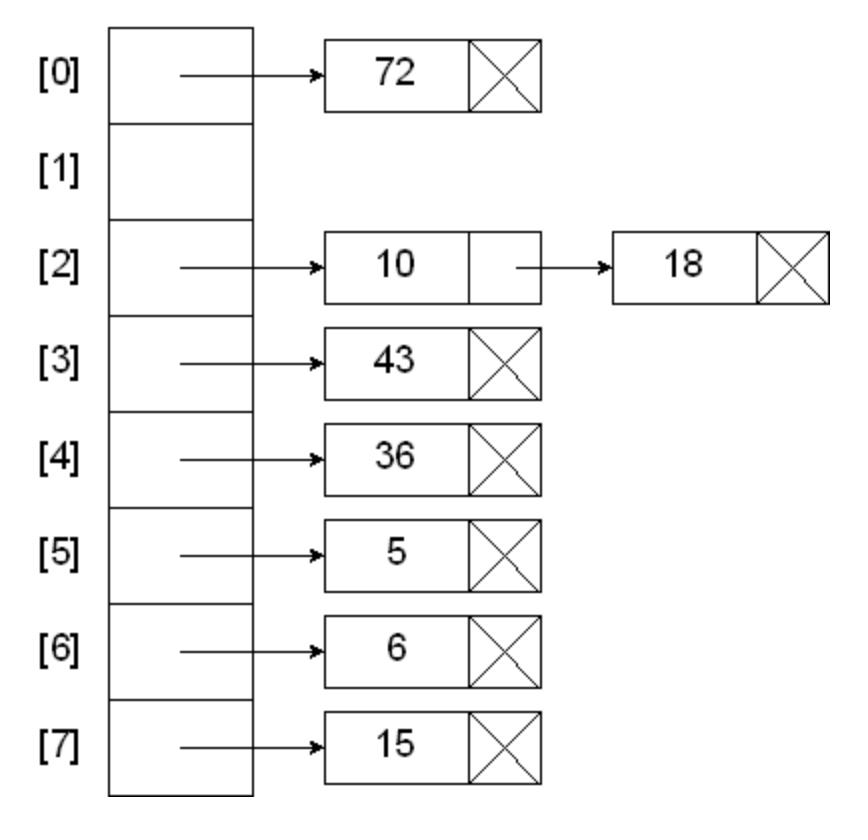

# wordFreqDB

## About
This application allows the client to query the frequencies of words based on a corpus dataset constructed by the Google (Books) Ngram Viewer Team, as well as insert new records as well as to replace and remove existing records. I implemented this application by using the STL vector class to create hash table as a vector of vectors. I made the choice to use chaining to deal with collisions. 


*See a representation of my hash table with chaining above! Maybe my next step is to write this program using open addressing?*

The program can parse and hash any text file in the correct format, although the given dataset_small and dataset_large are the aforementioned corpus datasets.

## Running the program
Using make wordDB to compile and executing ./wordDB [file], the user is prompted to enter 
```
:p [word][freq]
```
This command hashes the given word and creates an entry object with the frequency and word, checks if it is already contained in the table, and inserts it. If it is contained in the table, it updates the entry with the given frequency.
```
:g [word]
```
This command hashes the given word and searches for it in the hash table. If found, it will output the word and its frequency, otherwise will notify the user the word is not found.
```
:r word
```
This command removes the given word from the hash table and notifies the user if it is not found.
```
:q
```
This command quits the program.

